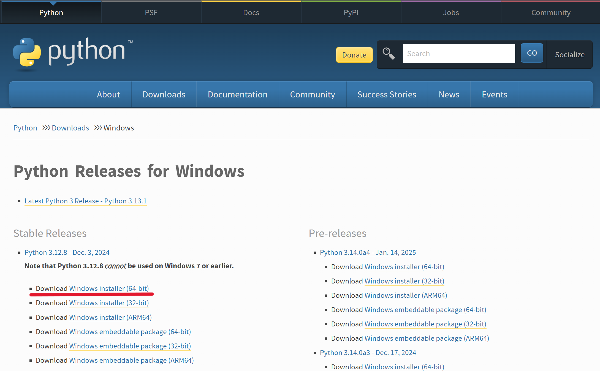
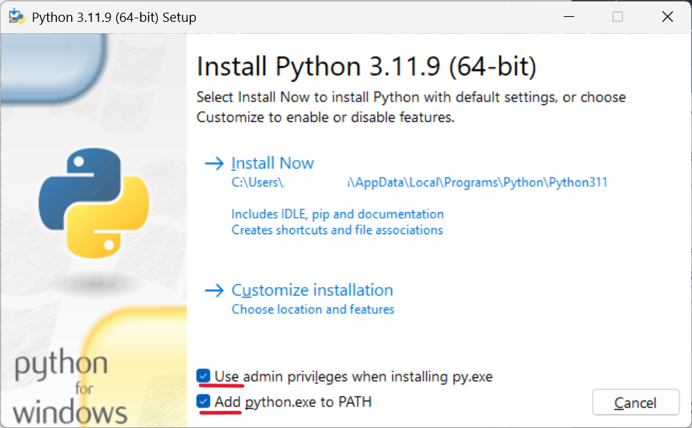

# Instalación de Python

## 1: Descarga
* Desde la **[Web oficial de Python](https://www.python.org/)** en la sección **Descargas >> Windows** identificar la version y dercargar el instalador.

    **Nota:** Recomendable instalar una versión estable. Reviar el estado de [Versiones de Python](https://devguide.python.org/versions/).




## 2: Instalación
* Ejecutar el instalador y marcar las dos opciones:
    * *Use admin privileges when installing py.exe*
    * *Add python.exe al PATH*



* Comprobar instalación de Python y PIP (gestor de paquetes para Python):
    * Abrir el Símbolo del sistema: *Windows+R* o buscar CMD y ejecutar.
        ```python
        python --version
        ```
    * Para verificar las instalación de PIP ejecutar.
        ```python
        pip --version
        ```


## 3: Configuración del PATH

* En el explorador de window buscar **varibales de entorno del sistema**.
    * Verificar que dentro de **path** exista la ruta ```C:\Users\...\AppData\Local\Programs\Python\Python311\Scripts\```.

    * En caso no exista la ruta. Con *Windows+R* buscar **AppData** y seguir  la ruta **Local>>Programs>>Python>>Python311>>Scrits**. y obtener la ruta de la carpeta y agregar dentro de **path** *(entorno de variables del sistema)*


## 4: Instalación de librerías
* En el [Respositorio oficial de Python](https://pypi.org/) se encuentran los paquetes y librerías.
    * Principales librerías:
        * NumPy: Cálculo y funciones numéricas.
        * Pandas: Análisis, manipulación y limpieza de datos.
        * Matplotlib: Visualización de datos.
        * Seaborn: Visualización de datos estilizada.
        * Plotly: Visualizaciones de datos interactivas.

* Para instalar usar el gestor de paquetes PIP y ejecutar en CMD.
    ```python
    pip install numpy
    pip install pandas
    pip install matplotlib
    pip install seaborn
    pip install plotly
    ```
